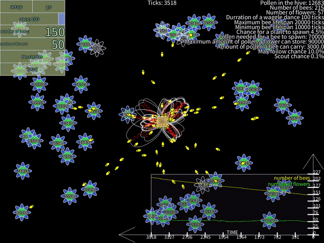

# Beehive Simulation

A bee colony simulation built with [Processing (Python mode)](https://py.processing.org/), inspired by the [waggle dance](https://en.wikipedia.org/wiki/Waggle_dance) — the remarkable communication behaviour real honeybees use to share the location of food sources with their colony.



---

## What is the waggle dance?

When a honeybee finds a rich flower patch, it returns to the hive and performs a figure-eight dance. The direction of the straight "waggle run" encodes the angle to the food source relative to the sun, and the duration encodes the distance. Other bees observe the dance and use that information to fly directly to the same patch — a form of collective intelligence that lets the colony efficiently exploit the best available resources.

This simulation models that behaviour at an individual bee level and lets you observe how it shapes the dynamics of the whole colony.

---

## How it works

Each bee operates as a simple agent with one of five states:

| State | Behaviour |
|-------|-----------|
| **Idle** | Waits at the hive; watches other bees dancing and may choose to follow |
| **Search** | Flies outward in a random walk looking for flowers |
| **Harvesting** | Travels to a known flower and collects pollen |
| **Returning** | Flies back to the hive carrying pollen |
| **Dance** | Performs the waggle dance, pointing toward its flower source |

When a harvesting bee returns full, it dances at the hive for a number of ticks proportional to how much pollen remains in the flower. Idle bees observe the dancers and, with a probability based on the dance intensity, fly out to that same flower — skipping the costly random search phase entirely.

Flowers deplete as bees harvest them. When a flower is exhausted it disappears, but while it still has pollen it can randomly spawn a new flower nearby. The hive converts accumulated pollen into new bees once a threshold is crossed.

---

## Running the simulation

1. Install [Processing](https://processing.org/download).
2. Click the **Java** button in the top-right corner of the Processing IDE and choose **Manage Modes...**.
3. Find and install **Python Mode for Processing 4**.
4. Switch to Python mode by clicking that button again and selecting **Python**.
5. Open `beehive.pyde` via **File > Open**.
6. Click **Run**, then press **Setup** and **Go** in the simulation window.

---

## Controls

| Control | Description |
|---------|-------------|
| **Setup** button | Initialise the simulation with the configured parameters |
| **Go** button | Start / pause the simulation |
| **Pace** slider | Control simulation speed |
| **Number of bees** field | Initial bee population |
| **Number of flowers** field | Initial flower count |
| **No render** button | Skip drawing (runs much faster for long experiments) |
| **Save** button | Export current traces and parameters to JSON/CSV |

---

## Parameters (configured in source)

| Parameter | Default | Description |
|-----------|---------|-------------|
| `DURATION_WAGGLE_DANCE` | 100 ticks | How long a bee dances |
| `max_lifespan` | 20 000 ticks | Maximum bee lifespan |
| `min_lifespan` | 10 000 ticks | Minimum bee lifespan |
| `scout_chance` | 0.1 % | Probability an idle bee scouts spontaneously |
| `max_follow_chance` | 10 % | Maximum probability of following a dancer |
| `max_per_bee` | 3 000 | Max pollen a bee can carry |
| `Flower.max_pollen` | 90 000 | Max pollen per flower |
| `Flower.spawn_rate` | 4.5 % | Chance a visited flower spawns a neighbour |
| `Hive.spawn_threshold` | 70 000 | Pollen needed to birth a new bee |

---

## Live graph

While the simulation runs, a real-time graph in the bottom-right corner tracks the **bee population** (yellow) and **flower count** (green) over time. The x-axis compresses automatically as the simulation runs longer.

---

## Saving results

Click **Save** (or wait for the automatic save at tick 30 000) to export:
- `data.json` — full population traces and initial parameters
- `data.csv` — flat trace data for further analysis

Dependencies used for the save/graph feature (`plotly`, `numpy`) require a virtual environment:

```bash
python -m venv venv
pip install plotly numpy
```
